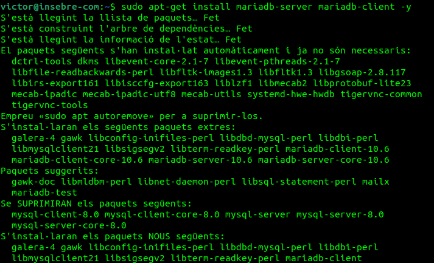
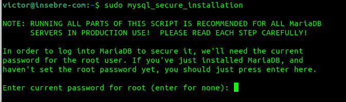

## OwnCloud.

Primer tenim que començar explicant que es OwnCloud:

Owncloud és un servei d'emmagatzematge i sincronització de fitxers multiplataforma que es pot instal·lar al nostre servidor.
Amb ell, qualsevol usuari amb un compte pot pujar informació i se sincronitzarà amb els altres usuaris a qualsevol dels seus dispositius.

## Instalació OwnCloud.

Primer de tot tenim que instalar lo servidor apache amb les seguents comanes:

sudo apt install apache2

Instalem MariaDB:

I configurem MariaDB

sudo mysql_secure_installation

* Deshabilitar usuarios anónimos.
* Deshabilitar acceso remoto como root.
* Eliminar las bases de datos de testeo y el acceso a las mismas.
* Actualizar las tablas de privilegios.

Reiniciem lo servidor:

sudo systemctl restart mariadb.service` o `sudo service mariadb.service restart

Entrem a MariaDB:

sudo mysql -u root -p

Creem la base de dades:

CREATE DATABASE owncloud;

Creem un usuari anomenat ownclouduser amb una contrasenya que podria ser Admin1234.

CREATE USER 'ownclouduser'@'localhost' IDENTIFIED BY 'Admin1234';

Us donem accés a l'usuari a la base de dades creada:

GRANT ALL ON owncloud.* TO 'ownclouduser'@'localhost' IDENTIFIED BY 'Admin1234' WITH GRANT OPTION;

Instal·lar PHP i els seus mòduls necessaris:
sudo apt-get install software-properties-common -y
sudo add-apt-repository ppa:ondrej/php
Actualitzem els paquets amb el repositori afegit:

sudo apt update
Instal·lem PHP i els mòduls necessaris:

Hem de tenir en compte els requisits d'Owncloud abans d'instal·lar els mòduls.

sudo apt install php7.4 libapache2-mod-php7.4 php7.4-common php7.4-mbstring php7.4-xmlrpc php7.4-soap php7.4-apcu php7.4-smbclient php7.4-ldap php7. 4-redis php7.4-gd php7.4-xml php7.4-intl php7.4-json php7.4-imagick php7.4-mysql php7.4-cli php7.4-mcrypt php7.4-ldap php7. 4-zip php7.4-curl -i
Després de la instal·lació editem el fitxer php.ini i canviarem alguns valors:

sudo nano /etc/php/7.4/apache2/php.ini
Els valors que hem de canviar són els següents:

file_uploads = On
allow_url_fopen = On
memory_limit = 256M
upload_max_filesize = 100M
display_errors = Off
date.timezone = Europe/Madrid
