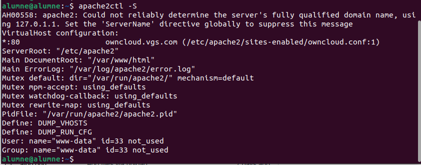
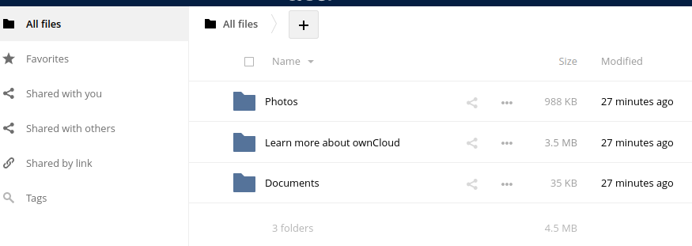
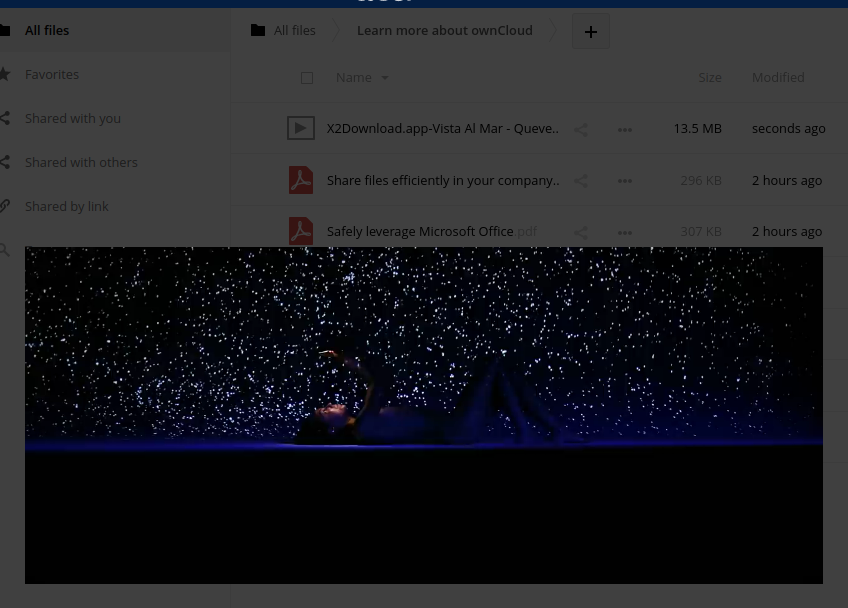
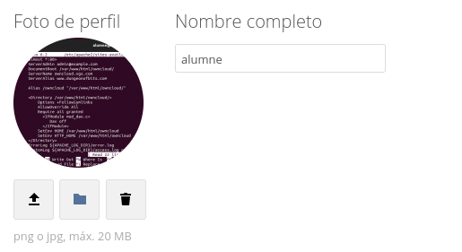
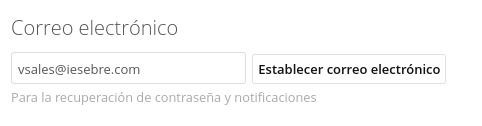
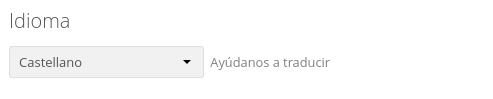
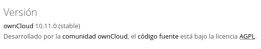

### 3.1.- Llista els Virtual Hosts d'Apache per tal de veure si owncloud.XYZ.com està habilitat amb la comanda:

apache2ctl -S

### 3.2.- A Owncloud podem veure que hi ha una serie de carpetes per defecte, mostra la ruta real a les tres carpetes dins de la teva MV.

### Quin són els tres tipus de protecció de dades que ofereix Owncloud?

*  Encriptació de trànsit.
*  Xifratge en repòs.
*  Xifratge d'extrem a extrem.

### Fes una petita descripció de cada un d'ells.

El xifratge en trànsit proporciona una manera de protegir les dades entre instàncies i sistemes de fitxers muntats mitjançant el xifratge 
TLS v. 1.2 (seguretat de capa de transport).

Quan s'habilita el xifratge de dades en repòs, vSAN xifra tot el contingut del magatzem de dades de vSAN. Com es xifra la totalitat dels fitxers, 
totes les màquines virtuals i les seves corresponents dades queden protegides. Només els administradors amb privilegis de xifratge poden realitzar tasques de xifratge i desxiframent.

El xifratge extrem a extrem (E2EE) garanteix que les vostres dades es xifren (es mantenen en secret) fins que arriben al destinatari previst. 
Tant si esteu parlant de missatgeria xifrada de punta a punta, correu electrònic, emmagatzematge de fitxers o qualsevol altra cosa, això garanteix que ningú del centre pugui veure les vostres dades privades.

### Per quina raó ens recomana utilitzar Owncloud per als documents de Microsoft Office de la nostra empresa?

Les organitzacions poden fer-ho fàcilment
operar solucions per compartir fitxers com ownCloud a casa o com a servei gestionat amb un proveïdor de confiança. Amb ownCloud i les seves aplicacions de Microsoft integrades, 
els empleats poden experimentar la productivitat total i la connectivitat perfecta sense arriscar-se a l'accés no autoritzat o a violacions de la protecció de dades, gràcies a un emmagatzematge de dades centralitzat al seu núvol privat. 
Realment és el millor dels dos mons. Com que ownCloud és de codi obert, les empreses eviten els bloquejos de proveïdors i aconsegueixen una transparència total del codi per a una tranquil·litat addicional.

### Això passa a tots els països?

Si sempre que tinguen les mateixes llicencies.

### Quina és la llicència d'OWncloud Enterprise?

Les subscripcions Enterprise d'OwnCloud inclouen el servidor, les aplicacions empresarials, els usuaris i les aplicacions mòbils, tota la solució OwnCloud. L'Enterprise Edition es basa en el servidor OwnCloud,
afegint les certificacions OwnCloud i les aplicacions corporatives per garantir que el programari estigui llest per ser utilitzat als entorns empresarials més exigents.

### I la d'Owncloud Standard?

Aquesta versió de OwnCloud dóna als usuaris la confiança que estan executant una solució amb un suport de classe mundial i especialista a OwnCloud. Aquesta subscripció és ideal per als usuaris professionals que busquen una solució daccés a arxius compatible,
però que no necessiten recursos corporatius i aplicacions OwnCloud. Amb levolució de les seves necessitats, els clients poden fàcilment actualitzar o modificar el seu propi OwnCloud per respondre a les seves necessitats específiques.

### Es poden veure videos en Streaming directament des de Owncloud?

Exemple streaming video OWNCLOUD:

* Posa't una imatge d'usuari.

* Afegeix el teu mail de l'Institut.

* Canvia l'idioma a català.

* Mostra la versió d'Owncloud instal·lada.

