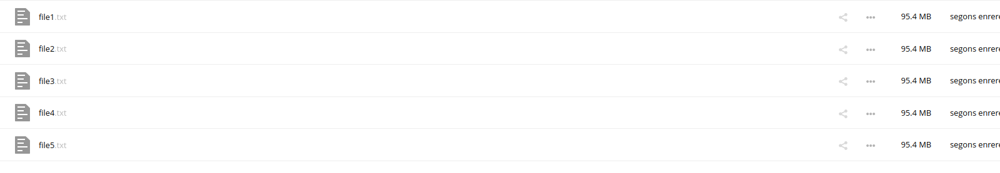

# Activitat 4:

## Gestió d'usuaris:

4.1.- Crea un usuari admin que es digui adminXYZ, on XYZ són les inicials del teu nom:

4.2.- Inicia sessió com a l'usuari adminXYZ.

4.3.- Crea un usuari XYZ on XYZ son les inicials del company/a i afegeix-lo al grup usuaris, aquest usuari tindrà una quota de 512 MB.

4.4.- Podem crear fitxers d'una mida determinada a Linux amb la comanda:

truncate -s 10M file.txt
A l'exemple es crea un fitxer de 10MB.

Crea 6 fitxers de 100MB i pujal's a Owncloud un per un.

4.5.- Mostra el missatge d'error per haver superat la quota d'usuari.

4.6.- Busca al teu perfil quin percentatge de quota estas utilitzant.

4.7.- Canvia la quota de l'usuari a 1GB i mostra tots els fitxers pujats.

4.8.- Crea un usuari anomenat usuari2XYZ i fical al grup usuaris.

4.9.- Comparteix un fitxer de usuariXYZ a usuari2XYZ i mostra com l'usuari2XYZ pot veure i descarregar el fitxer.

4.10.- Esborra la carpeta Learn more about owncloud.
4.11.- Recupera la carpeta Learn more about owncloud.

4.12.- Com a usuariXYZ crea una carpeta nova anomenada shared i comparteix-la amb l'usuari usuari2XYZ.

4.13.- Entra a Market instal·la dues aplicacions que no estiguin ja instal·lades i explica què fan i com funcionen.

Amb Calendar podem afegir un calendari al nostre owncloud per a poder organitzarnos.

Amb Wallpaper podem customitzar lo nostre owncloud posan fons de pantalla

4.14.- Crearem una carpeta nova per emmagatzematge a Owncloud, la carpeta serà /media/publicXYZ on XYZ són les teves inicials i apareixerà amb el nom de public als usuaris.

4.15.- Connectarem la carpeta publicXYZ com emmagatzematge local, tal i com s'indica aquí. Tots els usuaris tindran accés a la carpeta.

4.16.- Un usuari normal pujarà un fitxer a la carpeta public.

